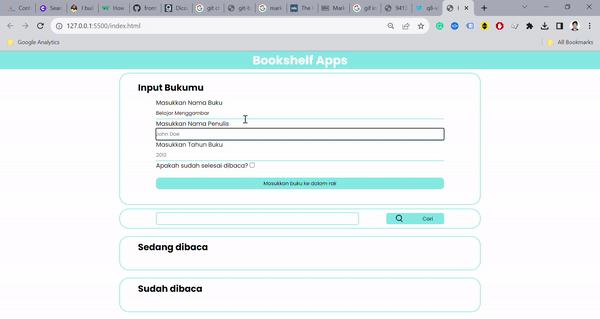
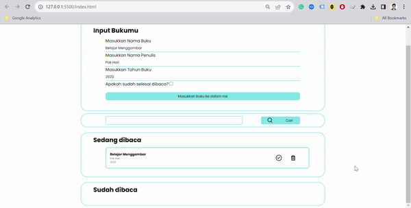
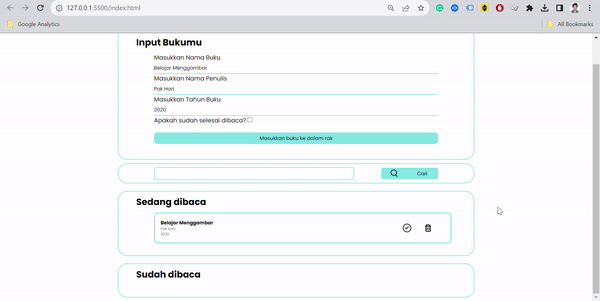

# Front End Track Dicoding - Bookshelf App

This is a simple Bookshelf App project as a requirement for "Belajar Pemrograman Front-End untuk Pemula" at Dicoding. The requirements of the app are:

<ul>
    <li>Able to <strong>add book into the list</strong></li>
    <li>Able to <strong>check the book as completed and vice versa</strong></li>
    <li>Able to <strong>delete the book from the list</strong></li>
    <li><strong>Utilize WebStorage API</strong> especially localStorage to store the data</li>
</ul>

Web App I created has several simple features mentioned above and there are several additional implementations, such as:

<ul>
    <li>Search Book</li>
    <li>Dialog Box for every book added</li>
    <li>Simple confirmation dialog for data deletion</li>
</ul>

# JavaScript Logic

The JavaScript code utilize implementations of functions to minimize tedious code writing. I created functions as listed below:

<ul>
    <li><strong>generateID</strong>: Generate ID based on timestamp</li>
    <li><strong>generateObject</strong>: Generate object from variables</li>
    <li><strong>readData</strong>: Read data from localStorage</li>
    <li><strong>pullData</strong>: Pull user's input and convert it as an object</li>
    <li><strong>saveData</strong>: Save data each time user's make changes</li>
    <li><strong>makeTodo</strong>: Create todo HTML</li>
    <li><strong>findBookIndex</strong>: Find index of book in data</li>
    <li><strong>searchPattern</strong>: Create search pattern from user's input in search field</li>
    <li><strong>searchBook</strong>: Find and render searched book in the shelf</li>
</ul>

For the apps interactivity, I created these functions:

<ul>
    <li><strong>moveBookToCompleted</strong>: Move book to completed</li>
    <li><strong>undoCompletedBook</strong>: Move book from completed</li>
    <li><strong>deleteBook</strong>: Delete book from bookshelf</li>
</ul>

# App Demo

<h3>Add book into the list</h3>

<h3>Move book from/to Completed</h3>

<h3>Delete book from the list</h3>

